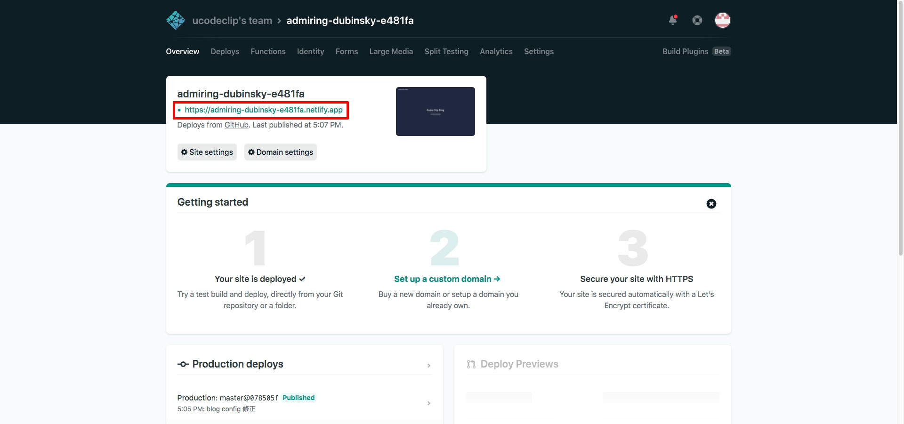

## ブログ作りました
エンジニアはブログを書いた方がいいと聞いたので、暇潰しがてら、[GatsbyJS](https://www.gatsbyjs.org/)と[Netlify](https://www.netlify.com/)を使ってブログ作ってみました。  
最初の投稿として何を書こうか迷ったのですが、せっかくなのでGatsbyJSとNetlifyを使った【爆速サイトの公開】を簡単に書いていこうと思います。

## 概要
表題の通りですが、GatsbyJSで作り、Netlifyでホスティングします。とりあえず公開するだけなら基本無料なので、安心です。

## GastbyJSのインストール
なにはともあれ、GatsbyJSのインストール。

```bash:title=shell
npm install -g gatsby-cli
```

インストールされているかの確認。

```bash:title=shell
gatsby --version
```

バージョンが表示されれば成功。

```bash:title=shell
Gatsby CLI version: 2.8.22
Gatsby version: 2.21.20
```

## サイトの作成
GatsbyJSには多くのスターターが用意されています。詳しくは[こちら](https://www.gatsbyjs.org/starters/?v=2)参照。

```bash:title=shell
gatsby new codeclip https://github.com/gatsbyjs/gatsby-starter-default
```

スターターは多くあるのですが、今回はデフォルトスターターを選択しました。`codeclip`の部分には作成するプロジェクトの名前、`https://github.com/gatsbyjs/gatsby-starter-default`の部分には自分で選んだスターターのurlを設定します。ちなみにデフォルトスターターの場合はurlの省略可能です。

サイトを作成したらディレクトリを移動し、
```bash:title=shell
cd　codeclip
```

開発用サーバーを立ち上げます。
```bash:title=shell
npm run start
```

`http://localhost:8000`にアクセスすると以下のような画面が表示されます。


開発用サーバーが確認できたら今度はプロジェクトをビルドします。
```bash:title=shell
npm run build
```

ビルドをすると`codeclip/public`にビルドされたファイルが出力されます。

ビルドされたファイルをローカルで確かめます。
```bash:title=shell
npm run serve
```

`http://localhost:9000`にアクセスすると開発用サーバーを立ち上げた時と同じ画面が表示されます。

無事表示されればサイトの完成です。

## NetlifyとGitの連携
まずはGithub,GitLab,Bitbucketなどのgitホスティングサービスを使ってリポジトリを作ります。（Gitに関しては割愛）

リポジトリを作成したらプロジェクトをコミットして、[Netlify](https://www.netlify.com/)と連携します。Netlifyのサイトに飛んだらSign Upをクリックして使用しているGitホスティングサービス（Github,GitLab,Bitbucketいずれか）を選びましょう。


管理画面にログインしたらあとは連携するだけです。`New site from Git`をクリックして、表示される指示に沿ってポチポチ。


- Build commandに`gatsby build`
- Publish directoryに`public/`

を入力します。


`Deploy site`をクリックでサイトのデプロイが始まります。

## 公開の確認

Deployが完成したらOverviewから公開サイトのURLが確認できます。



これで無事サイトが公開されました。

## サイトの更新
登録しているブランンチにコミット、マージなどで変更があると自動的にデプロイが走ります。便利ですね。

## まとめ
簡単にサイトを作成、公開することができました。時間としても上記手順だけなら一時間もいらないと思います。爆速サイト公開ですね。  
今回はただサイトの公開ということで、更新性のあるブログの作り方までには触れなかったのですが、今後どこかでマークダウンファイルを使ったブログの作り方に関しても書いていこうと思います。

## 参考
[Gatsby Quick Start](https://www.gatsbyjs.org/docs/quick-start)