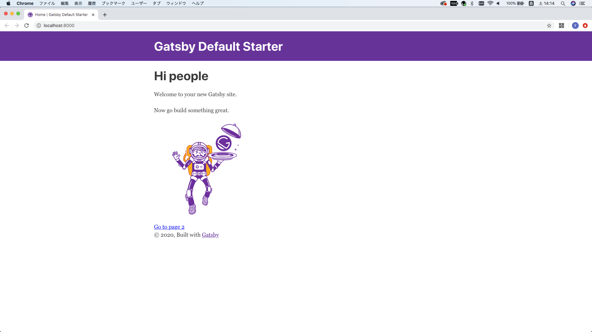
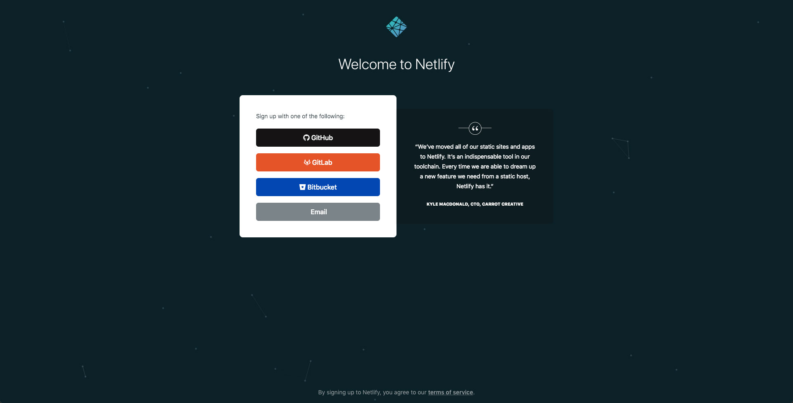
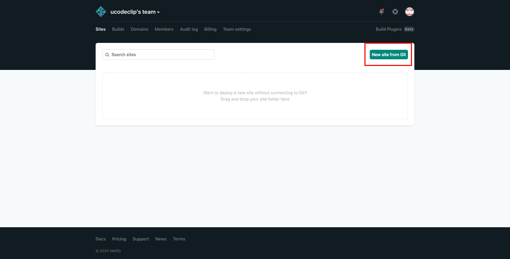
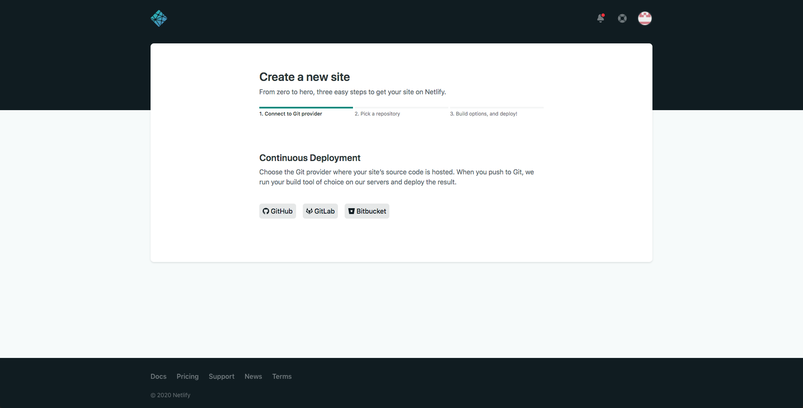
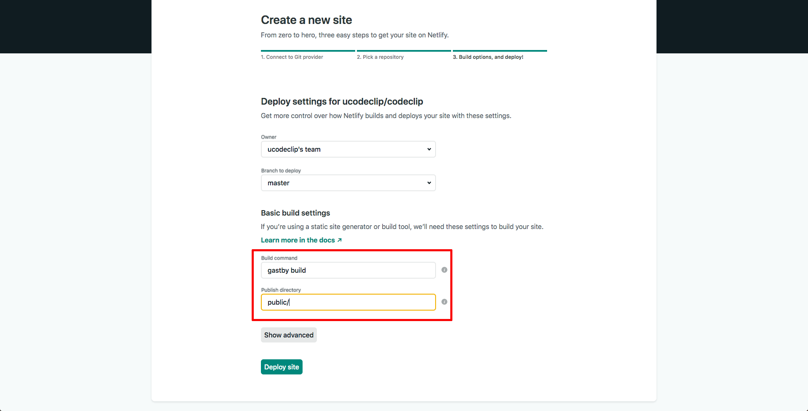

## ブログを作りました。
エンジニアはブログを書いた方がいいと聞いたので、暇潰しがてら、[GatsbyJS](https://www.gatsbyjs.org/)と[Netlify](https://www.netlify.com/)を使ってブログ作ってみました。  
せっかくなのでブログ作りの備忘録を簡単に書いていこうと思います。

## 概要
表題の通りですが、GatsbyJSで作り、Netlifyでホスティングしています。
思いつきで作ったのであれですが、一応上記技術の選定理由としては、

- 無料であること（ドメイン代は除く）
- サーバーの管理が必要ないこと
- デーダベースが必要ないこと

になります。

コンテンツの管理に関してはヘッドレスCMS（[Contentful](https://www.contentful.com/), [prismic](https://prismic.io/), [Netlify CMS](https://www.netlifycms.org/) etc...）を使用するかどうか悩んだのですが、後々に融通が効きそうなので、今回はローカルにマークダウンファイルを置くことにしました。
またGitのホスティングサービスには[GitHub](https://github.co.jp/)を使用しました。

## GastbyJSのインストール
なにはともあれ、gatsbyのインストール。

```bash:title=shell
npm install -g gatsby-cli
```

インストールされているかの確認。

```bash:title=shell
gatsby --version
```

バージョンが表示されれば成功。

```bash:title=shell
Gatsby CLI version: 2.8.22
Gatsby version: 2.21.20
```

## ブログの作成
GatsbyJSには多くのスターターが用意されています。詳しくは[こちら](https://www.gatsbyjs.org/starters/?v=2)参照。

```bash:title=shell
gatsby new codeclip https://github.com/gatsbyjs/gatsby-starter-default
```

ブログ用のスターターもあるのですが、今回はデフォルトスターターを選択しました。`codeclip`の部分には作成するプロジェクトの名前、`https://github.com/gatsbyjs/gatsby-starter-default`の部分には自分で選んだスターターのurlを設定します。ちなみにデフォルトスターターの場合はurlの省略可能です。

サイトを作成したらディレクトリを移動し、
```bash:title=shell
cd　codeclip
```

開発用サーバーを立ち上げます。
```bash:title=shell
npm run start
```

`http://localhost:8000`にアクセスすると以下のような画面が表示されます。



開発用サーバーが確認できたら今度はプロジェクトをビルドします。
```bash:title=shell
npm run build
```

ビルドをすると`codeclip/public`にビルドされたファイルが出力されます。

ビルドされたファイルをローカルで確かめます。
```bash:title=shell
npm run serve
```

`http://localhost:9000`にアクセスすると開発用サーバーを立ち上げた時と同じ画面が表示されます。

無事表示されればサイトの完成です。

## NetlifyとGitの連携
Github,GitLab,Bitbucketなどのgitホスティングサービスを使ってリポジトリを作りましょう。（Gitに関しては割愛）

リポジトリを作成したら[Netlify](https://www.netlify.com/)と連携します。Sign Upをクリックして使用しているGitホスティングサービス（Github,GitLab,Bitbucketいずれか）を選びましょう。



管理画面にログインしたらあとは連携するだけです。`New site from Git`をクリックして、表示される指示に沿ってポチポチ。





- Build commandに`gatsby build`
- Publish directoryに`public/`

を入力します。



`Deploy site`をクリックでサイトのデプロイが始まります。

## 公開の確認