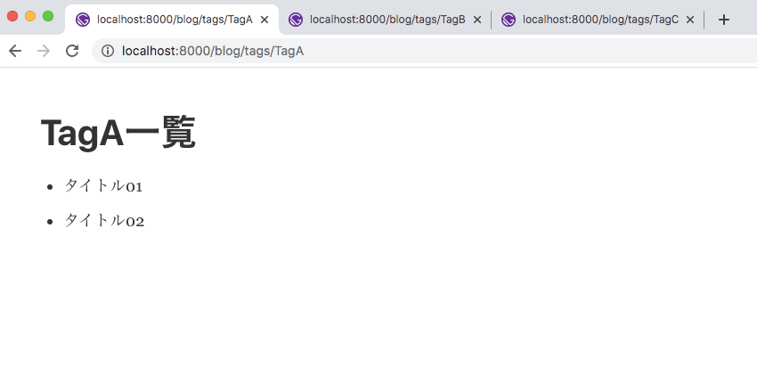
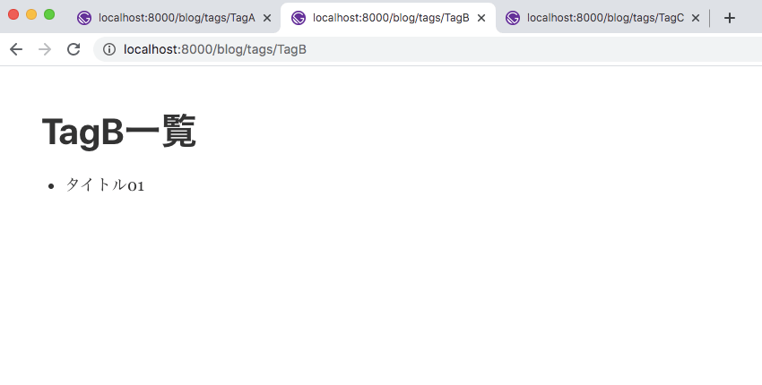
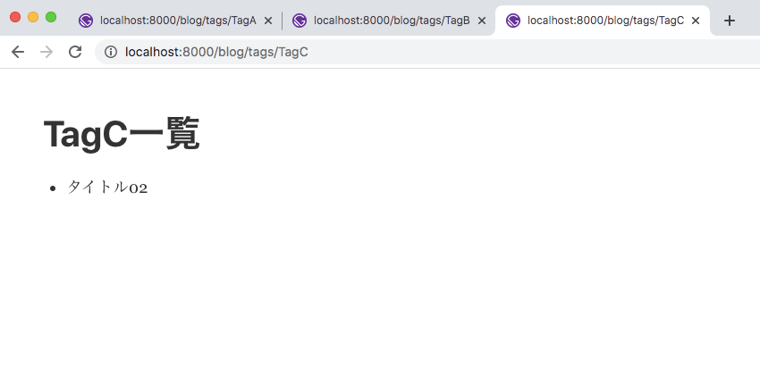

## 概要

GatsbyJS でタグ機能を実装したので、その手順をメモします。

## 前提

- 記事の一覧を GraphQL から取得できる
- `gatsby-transformer-remark`のプラグインで md(マークダウン)ファイルを使用している

## md（マークダウン）ファイルに tag の項目を作る

md（マークダウン）ファイルの最初の部分にメタ情報として title 項目と tag 項目の記述します。  
ちなみにこのメタ情報のブロックのことを`Front-matter`と言うらしいです.

今回はタグ一覧ページで絞り込みができているか確認するため md（マークダウン）ファイルを二つ作成します。  
タグが複数ある場合は下記のように記述します。

```yaml:title=index.md
---
title: タイトル01
tag:
  - TagA
  - TagB
---
```

```yaml:title=index2.md
---
title: タイトル02
tag:
  - TagA
  - TagC
---
```

## タグの抽出

まずは GraphQL の group 機能を使って md（マークダウン）ファイルに記述してあるタグを全て抽出します。

```js:title=gatsby-node.js
exports.createPages = async ({ graphql }) => {
  //groupを使用してtagを抽出するクエリ
  const tagsResult = await graphql(`
    query tagsQuery {
      allMarkdownRemark {
        group(field: frontmatter___tag) {
          fieldValue
        }
      }
    }
  `)

  console.log(JSON.stringify(tagsResult))
}
```

gatsyby-node に上の記述を行ってから build をすると、

```json:title=shell
{
  "data": {
    "allMarkdownRemark": {
      "group": [
        {"fieldValue":"TagA"},
        {"fieldValue":"TagB"},
        {"fieldValue":"TagC"}
      ]
    }
  }
}
```

タグの配列が返ってきてることがわかります。

## gatsby-node を使用してタグの一覧ページを作る

gatsby-node.js を使用してタグの一覧ページを作っていきます。  
抽出したタグから createPage を使ってページをタグごとの一覧ページを作成します。

```js:title=gatsby-node.js
const path = require('path')

exports.createPages = async ({ graphql, actions }) => {
  const { createPage } = actions;

  //groupを使用してtagを抽出するクエリ
  const tagsResult = await graphql(`
    query tagsQuery {
      allMarkdownRemark {
        group(field: frontmatter___tag) {
          fieldValue
        }
      }
    }
  `)

  const sampleTemplate = path.resolve("./src/template/temp.js")
  //タグの数だけforEachでループする
  //テンプレート側で絞り込みをするため、contextで値（タグ）を渡す
  tagsResult.data.allMarkdownRemark.group.forEach(v => {
    const path = '/blog/tags/' + v.fieldValue
    createPage({
      path: path,
      component: sampleTemplate,
      context: {
        tag: v.fieldValue
      }
    })
  });
}
```

## template ファイルを準備する

クエリーの filter でタグの絞り込みをします。  
gatsby-node の context から受け取った値を使います。

```js:title=/src/tempalte/temp.js
import React from "react"
import { graphql } from "gatsby"

//gatsby-nodeからcontextで受け取ったtagの表示
const ArchivePage = (props) => {
  const tag = props.pageContext.tag;
  const articles = props.data.allMarkdownRemark.edges;
  return (
    <div style={{'margin':'50px'}}>
      <h1>{tag}一覧</h1>
      <div>
        <ul>
          {
            articles.map((v,i)=>{
              return (
                <li key={i}>{v.node.frontmatter.title}</li>
              )
            })
          }
        </ul>
      </div>
    </div>
  )
}

//contextで受け取ったtagを使用して、filterで絞り込みをする
export const query = graphql`
  query ArchiveQuery($tag: String) {
    allMarkdownRemark (
      filter: {frontmatter: {tag: {eq: $tag}}}
      ) {
      edges {
        node {
          frontmatter {
            title
            tag
          }
        }
      }
    }
  }
`
export default ArchivePage
```

ここまで記述したら、開発サーバーを立ち上げ

`http://localhost:8000/blog/tags/TagA`  
`http://localhost:8000/blog/tags/TagB`  
`http://localhost:8000/blog/tags/TagC`

にアクセスします。




タグで絞り込んだ記事タイトル一覧が表示されていれば完成です。

## まとめ

gatsby-node と GraphQL の group 機能を使うことによって簡単にタグ機能の実装ができました。  
カテゴリ機能も同様な感じで実装できると思います。
